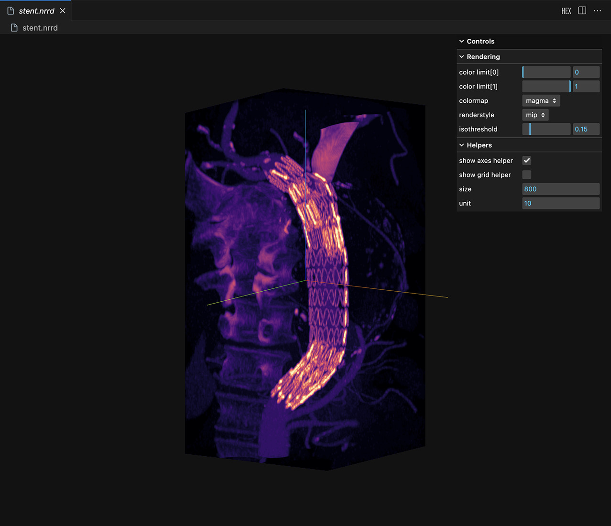

# VSCode Volume Viewer

**See in VS Marketplace:** [vscode-volume-preview](https://marketplace.visualstudio.com/items?itemName=tatsy.vscode-volume-preview)

## Description

This extension allows the VSCode to visualize the volume data (*.nrrd). The data which can be visualized can be exported by [ImageJ2](https://imagej.net/software/imagej2/) (aka Fiji) or [pynrrd](https://pynrrd.readthedocs.io/en/stable/).

## Features

This extension currently supports only NRRD format.

### Screen shots

(The stent data is provided by [ImageIO standard images](https://imageio.readthedocs.io/en/stable/user_guide/standardimages.html))

## FAQ

* Q. When I drag&drop a mesh file, a blank display is shown.
    * A. To show a 3D data using this extension, you should first open a workspace including the 3D data that you want to open.

## Reference

* [vscode-3d-preview](https://github.com/tatsy/vscode-3d-preview)
* [vscode-3dviewer](https://github.com/stef-levesque/vscode-3dviewer)
* [vscode-pc-viewer](https://github.com/Obarads/vscode-pc-viewer)
* [three.js](https://threejs.org/)

## Lincense

GNU General Public License v3 2025 (c) Tatsuya Yatagawa
